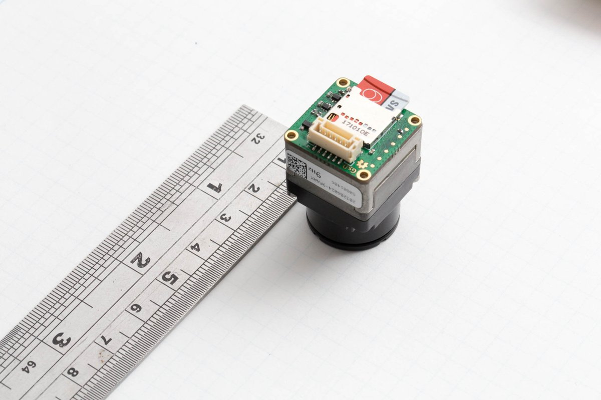

# bosonFrameGrabber

	Project Stage: Basic MVP achieved

A Small FPGA based board. Designed to connect to a FLIR Boson Camera, and save images from the camera to a microSD card.

hw 1_02 is the latest functionaly hardware that fits just behind the back of the Boson. (Pictured Above)

## Project Status:
 + hw 1_01 working (reached limitations of FPGA)
 + hw 1_02 status
   + designed/assembled prototypes
   + Working on Firmware on a softcore riscv CPU. 
   + Basic capture system implmented in rtl.
   + Basic driver for SD card access using FatFS and SD-controller.