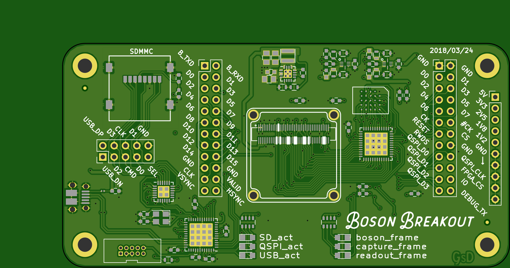
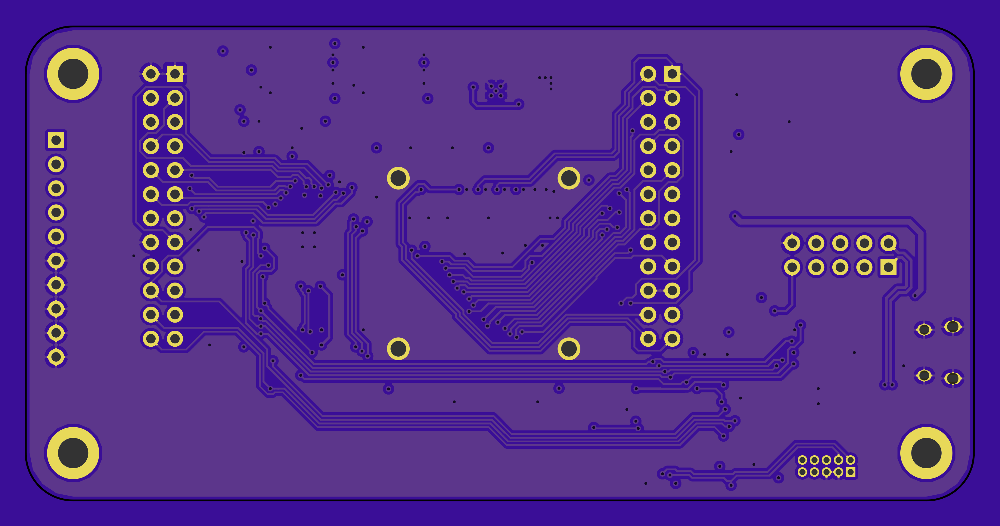

# bosonBreakout

	Project Stage: VERY Early Development

(Initially a project called: CrushedICE)

A FPGA based camera interface board. This PCB was developed before the bosonFrameGrabber, and has a vastly different architecture. It uses an ICE5LP4K, HyperRAM and a QSPI bridge to a SAMD51.

FPGA+RAM will act as a FIFO, connect to SAMD51 via QSPI. To read out a frame when required. SAMD51 has a SDMMC module so it handles the writing to an SD card. 

Filled with test headers to make it easy to connect to a Saleae Logic analyser.

## Hardware

* ICE5LP4K in QFN48 package
* HyperRAM: high density, but low pin count.
* QSPI Bus
* Microchip SAMD51
* MicroSD socket
* 16MHz Oscillator
* 6x LEDs!
* TOO MANY TEST POINTS!
