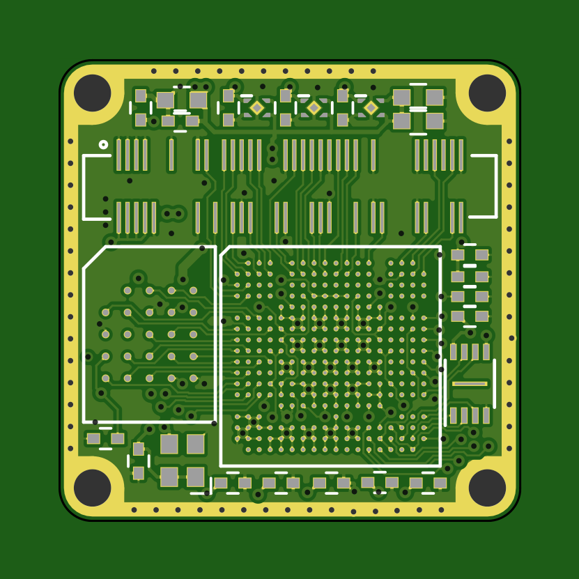

# bosonFrameGrabber

	Project Stage: VERY Early Development

A Small FPGA based board. Designed to connect to a FLIR Boson Camera, and save images from the camera to a microSD card.

## Hardware

* ECP5 in csBGA285 package
* 64Mb/128Mb HyperRAM
* 8Mb QSPI Memory
* MicroSD socket
* 24Mhz MEMs Oscillator
* JST GH SM06 locking Data/Power connector
* JTAG exposed via pogo pin pads.
* 2x 5V tolerant I/Os on connector
* 1x LED

Prototype Limitations:
* 3.3V only! (Integrated LDOs handle FPGA rails, but input power is connected directly to the Boson)

## Prototype

