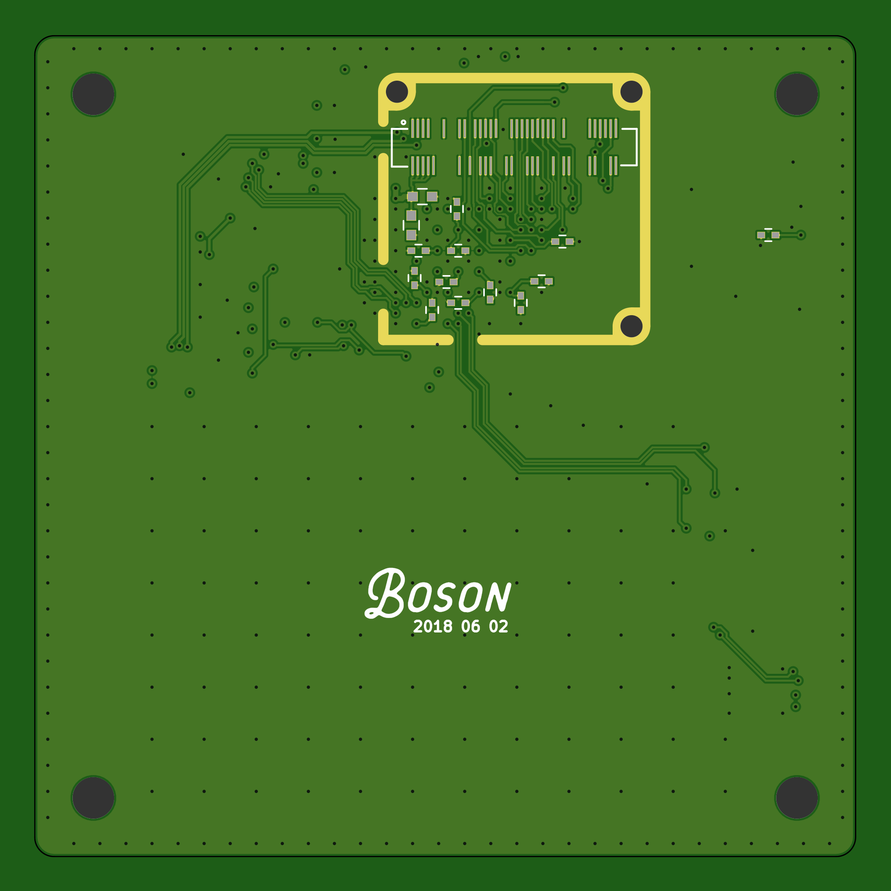

# bosonFrameGrabber 1_03

	Development BigBoard (Do not use! known errata)

Due to supply issues of the ECP5 in cs285 I developed this PCB to start work on firmware. Despite many errata the board was functional (after mods) and did aid in fw development.

## Errata
* 1V8 line shorted by a via (didn't run DRC)
* SysConfig pins are not correct for loading bitstream from SPI.
* Incorrect pins connected to QSPI.
* 3V3 not connected to backlinght DCDC

## Hardware

* ECP5 
* 8MB/16MB HyperRAM: high density, low pin count.
* 1MB QSPI Memory (XSON 3x2 package)
* MicroSD socket
* MEMs Oscillator
* JST GH SM06 locking Data/Power connector
* JTAG on GH SM06
* 2x 5V tolerant I/Os on connector
* 1x LED
* 240x240 IPS LCD. (used on NANO v6, MIPI interface)

