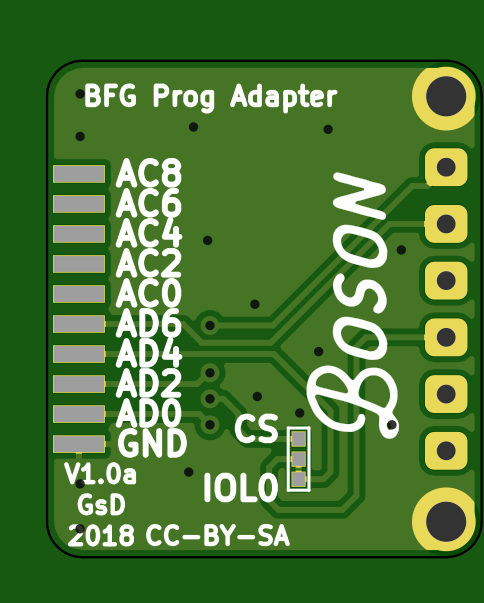
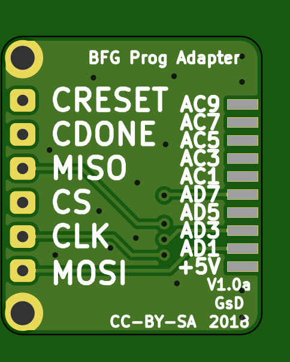

# programmerAdapter

	Project Stage: Early Development

A simple adapter for Esden's ftdi universial Breakout board.  https://github.com/icebreaker-fpga/icebreaker/tree/master/hardware/ftdi-v1.0a 

## Design
Designed to suit the BosonFrameGrabber PCB. This design uses pogoPins to make connection and screws over the mounting holes into the Boson.

## Licence 

To match Esden's work this PCB is licenced: CC-BY-SA